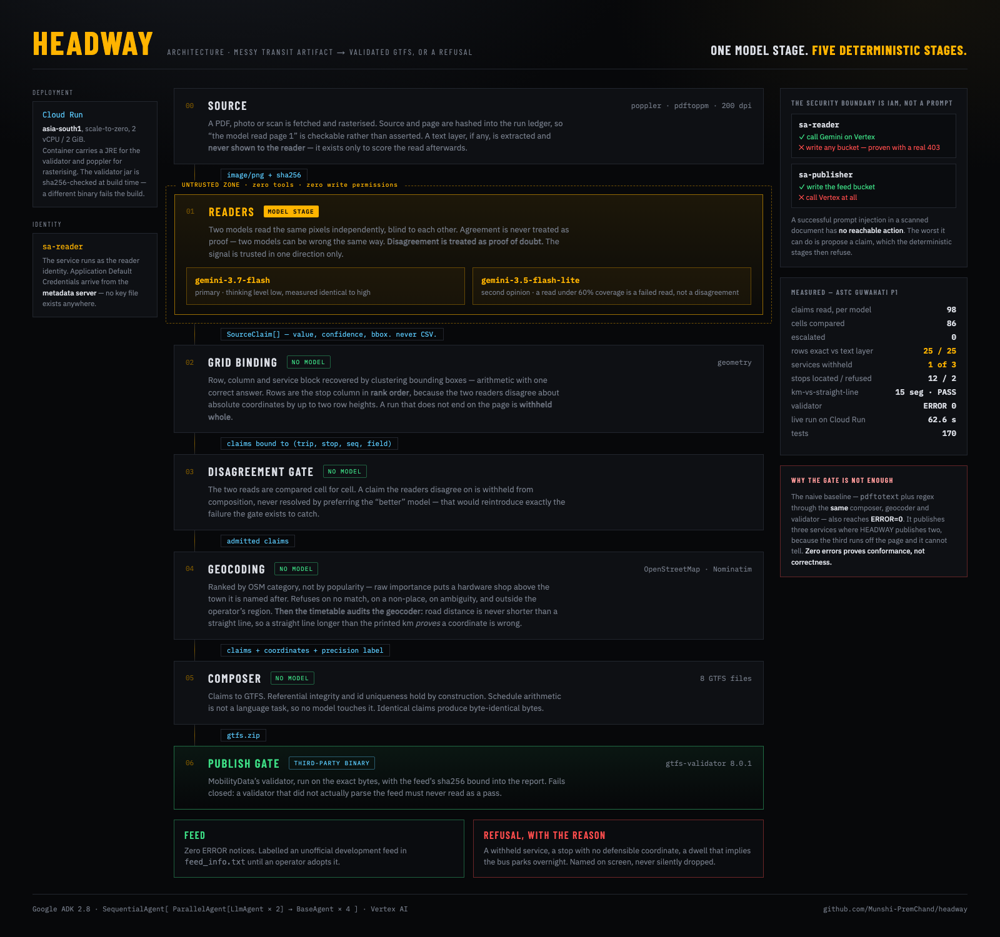

# HEADWAY

**A bus timetable is not data until someone types it in. This agent does the typing, and refuses when it
cannot read.**

India has **20 transit feeds** in the Mobility Database — the catalogue Google Maps, Transit and
OpenTripPlanner draw from. **Nine of them are still active.** France has 1,127, of which 859 are active.

> **One active catalogued transit feed per 161 million Indians.
> In France, one per 79,359. A 2,031-fold gap.**

The reason is not technology. Indian timetables exist as photocopies, board notices and painted boards,
not CSVs.

Reproduce it in thirty seconds:

```bash
curl -sO https://files.mobilitydatabase.org/feeds_v2.csv
python3 -c "
import csv,collections
r=[x for x in csv.DictReader(open('feeds_v2.csv')) if x['location.country_code']=='IN']
print(len(r), collections.Counter(x['status'] for x in r))"
# 20 Counter({'active': 9, 'inactive': 8, 'deprecated': 3})
```

*(Measured 2026-08-27, 6,496 feeds total. Population: World Bank `SP.POP.TOTL`, 2024.)*

**India's feeds are not merely missing — they are lapsing.** A liveness check of all 20 download URLs on
2026-08-27 found **8 working**. Kochi Metro, India's *first* GTFS agency, is deprecated with a dead DNS
name. Delhi's DTC and Maharashtra's MSRTC both 404. Hyderabad Metro Rail — the only official active metro
feed — returns an HTML interstitial instead of a ZIP. India has **zero** GTFS-Realtime feeds catalogued.

That is the thesis in one sentence: *a feed is not a one-time artifact, it is a build that has to keep
passing.*

HEADWAY reads those artifacts and produces a standards-valid GTFS feed — or refuses, loudly, with the
reason attached.

---

## Architecture



*Live at [`/architecture`](https://headway-606499459461.asia-south1.run.app/architecture); re-shoot with
`scripts/shoot_architecture.sh`. It is HTML rather than a drawing so its numbers come from the same place
everything else does, instead of drifting from the code the moment either changes.*

## What it actually does

```
photo / PDF / voice memo
        │
        ▼
┌───────────────────┐   two INDEPENDENT reads, blind to each other
│  Reader (Gemini)  │   gemini-3.7-flash + gemini-3.5-flash-lite
└───────────────────┘   zero tools · zero write permissions
        │  typed SourceClaims: what the cell says, and where it is
        ▼
┌───────────────────┐   NO MODEL. Rows, columns and page-truncation recovered
│   Grid binding    │   from bounding boxes. Geometry has one correct answer.
└───────────────────┘
        │
        ▼
┌───────────────────┐   NO MODEL. Disagreement between readers WITHHOLDS
│ Disagreement gate │   the claim. Agreement is never treated as proof.
└───────────────────┘
        │
        ▼
┌───────────────────┐   NO MODEL. OpenStreetMap, then the timetable's own km
│    Geocoding      │   column audits the answer. Refuses rather than guess.
└───────────────────┘
        │
        ▼
┌───────────────────┐   NO MODEL. Schedule arithmetic is not a language task.
│     Composer      │   8 GTFS files, byte-identical rebuilds.
└───────────────────┘
        │
        ▼
┌───────────────────┐   MobilityData gtfs-validator 8.0.1 — a binary we did
│   Publish gate    │   not write. Zero ERROR notices or nothing ships.
└───────────────────┘
```

**One model stage. Five deterministic stages.** That asymmetry is the whole design.

## Live

**https://headway-606499459461.asia-south1.run.app** — deployed on Cloud Run, running as a service
account that can call Vertex AI and provably cannot write any bucket. The **Execute pipeline** button
runs the whole thing server-side against the live ASTC PDF in about 60 seconds: fetch, render at 200 dpi,
two Gemini models on Vertex, bind, geocode, compose, and re-run `gtfs-validator`. Nothing on that page is
cached when you press it.

## It has been run, on a real Indian timetable

Not a fixture. Page 1 of Assam State Transport Corporation's Guwahati division timetable — a 2020 Word
document printed to PDF, ten A4 pages of numbered service blocks:

```bash
python3 scripts/run_pipeline.py \
    --pdf https://st.redbus.in/Images/WL/ASTC/schedules_new/Guwahati_division.pdf --page 1
```

```
98 claims read by each of two models, independently
 → 91 bound by geometry · 2 complete service blocks · 1 WITHHELD for running off the page edge
 → 0 escalated on reader disagreement
 → 12 of 14 stop names located · 2 REFUSED rather than guessed
 → 15 segments audited against the printed km column: PASS, tightest margin 6.5 km
 → 2 trips · 12 stops · 17 stop_times
 → gtfs-validator 8.0.1: ERROR=0 WARNING=0
```

**25 of 25 rows transcribed exactly**, scored against the PDF's embedded text layer — extracted but never
shown to the reader, so it is an independent oracle rather than a hint. Three consecutive live runs
produced the byte-identical feed `70224a64…`.

**The two things it refused to do are the point.**

*Service 3 was withheld.* "Guwahati to Bihpuria" runs off the bottom of page 1, and its last visible row
still carries a departure time — so the bus does not terminate there. Publishing it would have asserted
that a 409 km coach service ends at a village halfway along. A completed run ends with an arrival and no
departure; that is structure, not a guess.

*Laluk and Jagiroad got no coordinates.* OpenStreetMap has no place node for either. The best match for
"Jagiroad" is **Jagiroad Hardware Stores in Guwahati, 60 km away**. Both were refused, both stops were
omitted from their trips, and both are named on screen. A missing stop is visible to a rider; a stop in
the wrong town is not.

And the arrival/departure distinction survives, which is why this artifact was chosen: Khanapara is
`07:30 → 07:35`, a real five-minute dwell, not one instant repeated into two columns.

### Measured against the obvious alternative

This PDF has a text layer, so the fair question is why a vision model is needed at all.
`scripts/baseline_textlayer.py` answers it by running `pdftotext -layout` plus regular expressions
through the **same** composer, geocoder and validator — the two differ in exactly one place:

| | trips | stop_times | the service that runs off the page | validator |
|---|---:|---:|---|---|
| Baseline — text layer + regex | **3** | 23 | **published** | ERROR=0 WARNING=0 |
| HEADWAY | 2 | 17 | **withheld** | ERROR=0 WARNING=0 |

**Both pass. One is false.** The baseline publishes a 409 km coach service as though it terminates at a
village halfway along, and the validator reports zero errors either way.

Stated plainly: on a page *with* a clean text layer, the baseline extracts the same 25 rows, 22 arrivals
and 23 departures. HEADWAY's transcription advantage here is **zero**. What it adds is the refusal — and
working at all on a photocopy, a board notice or a phone photograph, where no text layer exists.

## The claims, and the evidence for each

### 1. It refuses rather than guesses

A wrong departure time is the one error class **no validator on earth catches** — a plausible time passes
every conformance check and still sends someone to a stop for a bus that is not coming.

Measured on a 20-cell fixture with one genuinely destroyed cell, n=3 per thinking level:

```
9 of 9 runs ABSTAINED on the unreadable cell.
19/20 correct · 0 confident-wrong · 1 abstained · identical at low/medium/high
```

`make calibrate` reproduces it. Ground truth is frozen in `fixtures/scans/route12a_truth.json`.

### 2. No model writes a CSV byte

`Composer` and the gates are ADK `BaseAgent` subclasses with **no `model` field at all**. Referential
integrity and id uniqueness hold by construction. Monotonic times are enforced by *normalisation*
(`23:45 → 24:15`), which is stated honestly because it is not the same guarantee.

### 3. The timetable audits the geocoder

A wrong coordinate is the one error the publish gate cannot see: `gtfs-validator` checks that a stop
**has** a latitude, never that it is the right one. A stop placed in the wrong town passes every
conformance check and sends a rider 200 km astray.

The ASTC page prints a `km` column — distance along the road from the origin — and road distance is never
shorter than a straight line. So if the crow-flies distance between two consecutively geocoded stops
exceeds the road distance printed between them, a coordinate is wrong by arithmetic rather than by
suspicion.

On the real page: **15 segments checked, all pass, tightest margin 6.5 km.**

And it catches the case it was built for. Accepting the hardware store as "Jagiroad" puts it 95.5 km in a
straight line from Nagaon, on a leg the timetable prints as **68 km of road** — 27.5 km further than the
road itself, which no route between two points can be. The check fails it with 5.7 km to spare after the
slack allowed for coordinate imprecision.

### 4. A hallucination cannot reach the outside world

Enforced by IAM, not by a prompt:

| Service account | Can | Cannot |
|---|---|---|
| `sa-reader` | call Gemini | **write any bucket** |
| `sa-publisher` | write the feed bucket | **call Vertex at all** |

Proven, not asserted — `sa-reader` attempting a write returns a real Google 403 and the bucket listing
shows nothing landed. See [`docs/INFRASTRUCTURE.md`](docs/INFRASTRUCTURE.md).

## Quick start

```bash
make setup        # venv, pytest, and the gtfs-validator jar (sha256-pinned)
make test         # 167 tests
make pipeline     # the whole thing, live, on a real ASTC page
make build        # claims -> 8 GTFS files -> zip
make validate     # runs the real validator; exits non-zero on any ERROR
make ambiguity    # shows which ambiguities escalate and which are suppressed
make calibrate    # re-runs the thinking-level measurement against Vertex
```

`make validate` runs the validator in `eclipse-temurin:21-jre` when no local Java runtime is present, so
it needs Docker or a JRE. `make pipeline` needs `poppler` for `pdftoppm`, and any ONE of these
credentials — an ADC file is **not** required:

```bash
export GOOGLE_API_KEY=...                  # free AI Studio key: no GCP project, no card
gcloud auth application-default login      # Vertex, ADC
gcloud auth login                          # Vertex, access token — this is enough
```

## The demo beat

Two ambiguous cells, near-identical confidence, opposite handling:

| cell | confidence | rider outcome if wrong | decision |
|---|---:|---|---|
| smudged digit at a **depot** (no boarding) | 0.68 | none — nobody boards there | **resolved silently** |
| smudged digit at a **dialysis centre** | 0.71 | 21 journeys retimed | **one question asked** |

**A confidence threshold cannot separate those two.** The outcome differ can, because it compiles both
readings and compares what a *rider* would experience. That is why the agent is not a wrapper around OCR.

## Documentation

| Document | Contents |
|---|---|
| [`docs/VERIFIED_STACK.md`](docs/VERIFIED_STACK.md) | Model IDs, capabilities and limits verified against primary sources. Includes two model IDs that **do not exist** and were nearly built on. |
| [`docs/INFRASTRUCTURE.md`](docs/INFRASTRUCTURE.md) | GCP project, service accounts, the IAM deny and its proof. |
| [`docs/CHANGELOG.md`](docs/CHANGELOG.md) | Every defect found, with the measurement that found it. |

## Honest limits

* The calibration fixture is **rendered**, not a real photocopy — and so is the ASTC PDF, which is a Word
  document printed to PDF rather than a scan. Neither set of numbers is a claim about performance on a
  genuine photocopy or a phone photo. That is the next test, not a solved one.
* Two of the fourteen stops on the demonstrated page have **no coordinates at all**, because
  OpenStreetMap does not hold them. The feed is correct about the twelve it publishes and silent about
  the two it cannot place; it is not a complete representation of the service.
* ASTC's operating days are **assumed daily**. The PDF does not state them. The assumption is declared in
  the operator profile, printed as an assumption on every run, and must be confirmed by the operator
  before this feed is published anywhere.
* A generated feed is an **unofficial development feed** until an operator adopts it. It is labelled that
  way in `feed_info.txt` and is never submitted to a catalogue without consent.
* Zero ERROR notices from the validator proves **conformance, not correctness**. A completely false
  timetable can validate cleanly. The correctness number is cell-level fidelity against a frozen
  transcription, and it is reported separately.

## Prior art, named because hiding it would be worse

**National RTAP GTFS Builder** — the US incumbent, federally funded, and by its own published figures
*"Initial Data Input — average 4 hours per route."* It is macro-enabled Excel plus Google Earth: a human
types the schedule in. It reads no documents. HEADWAY removes the transcription, not the tool.

Also: `MobilityData/gtfs-validator` (the publish gate here), `gtfs-diff`, `heijul/pdf2gtfs` (dormant since
2023, text-layer PDFs only), and `k23rs125/gtfs-jp-creator` (Apr 2026 — photographed timetable to GTFS-JP
with a deterministic composer and a validator gate, the closest relative).
